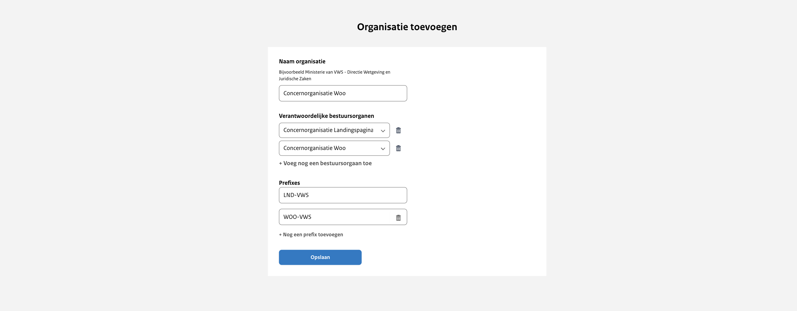

# Configuratie van de organisatie

Iedere concernorganisatie krijgt een eigen organisatie in het uploadportaal van het Woo Publicatieplatform. Deze organisatie
kunnen we configureren aan de hand van een aantal parameters. Zie onderstaande fictieve organisatie ‘Concernorganisatie Woo’.

Om de organisatie naar wens te kunnen configureren vragen we je om informatie aan te leveren. Om welke informatie het gaat
lees je in onderstaande paragrafen. We willen je vragen om de tabel uit bijlage 2 in te vullen en per e-mail met ons te delen
via <woo-platform@irealisatie.nl>.

## Naam organisatie

Als naam van de organisatie in het uploadportaal kan de volledige naam of een afkorting van de concernorganisatie worden gebruikt.
Deze naam wordt niet getoond op de publieke website maar is wel zichtbaar in de balie.

## Verantwoordelijke bestuursorganen

Aan iedere organisatie in het uploadportaal kunnen we één of meerdere bestuursorganen koppelen namens wie gepubliceerd kan worden.
Dit is in ieder geval het eigen bestuursorgaan en kan daarnaast een ander bestuursorgaan zijn.
Bij het aanmaken van een nieuwe publicatie wordt gevraagd wie het verantwoordelijke bestuursorgaan is van de publicatie.
Er kan gekozen worden uit de bestuursorganen die zijn gekoppeld aan de organisatie.
Het gekoppelde verantwoordelijke bestuursorgaan wordt getoond op de publieke website op de detailpagina's van de publicaties
en documenten. Daarnaast is het een filteroptie op de algemene zoekpagina.

## Prefix

Een prefix is een kenmerk van minimaal 5 karakters. Samen met het referentienummer
vormt de vaste prefix van de organisatie een uniek ID voor iedere publicatie.
Iedere organisatie heeft één vaste prefix. Deze prefix wordt bij het configureren
van de organisatie vastgelegd en bij het aanmaken van een publicatie automatisch
gebruikt; gebruikers hoeven geen prefix te selecteren.

De prefix wordt niet getoond op de website, maar wordt gebruikt in de URL van de
detailpagina's van publicaties en documenten. Een URL is als volgt opgebouwd:
`/[informatiecategorie]/[prefix]/[referentienummer]`, bijvoorbeeld
`/convenant/WOO-VWS/123456`.
