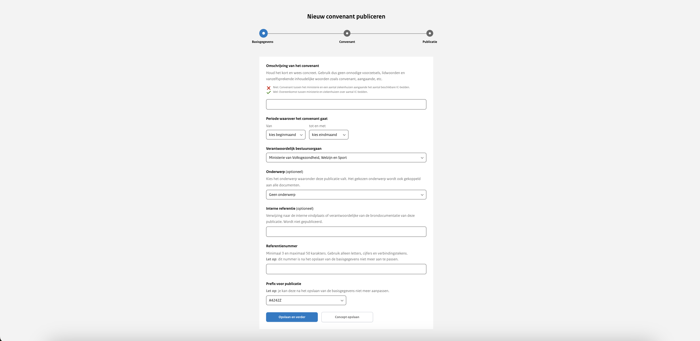

# Stap 1: Basisgegevens

## Omschrijving

Bij de omschrijving van het convenant gebruik je geen onnodige voorzetsels, lidwoorden of vanzelfsprekende woorden, zoals 'convenant' en 'aangaande'. Deze omschrijving wordt als titel op de website getoond. Dit veld is verplicht om in te vullen.

## Periode van het convenant

In de vakjes kunnen de datums gekozen worden voor de periode gedurende het convenant geldig is. Je kunt een periode kiezen
die begint vanaf 10 jaar geleden tot 5 jaar in de toekomst. Het invullen van de beginmaand is verplicht.

## Verantwoordelijk bestuursorgaan

Selecteer in het dropdown-menu het bestuursorgaan dat verantwoordelijk is voor deze publicatie. Als er slechts één keuze is,
wordt deze automatisch geselecteerd. Het is alleen mogelijk om namens een bestuursorgaan te publiceren dat aan je organisatie
is gekoppeld. Een bestuursorgaan kan aan meerdere organisaties gekoppeld worden. Dit veld is verplicht om in te vullen.

## Onderwerp

Hier selecteer je een onderwerp uit een lijst van onderwerpen die van toepassing zijn op deze publicatie. De onderwerpen worden
aangemaakt door de organisatiebeheerder van je organisatie.

## Interne referentie

De interne referentie is een vrij invulbaar veld dat niet wordt gepubliceerd. Je kunt dit veld bijvoorbeeld gebruiken ter
verwijzing naar de vindplaats van de oorspronkelijke brondocumentatie.

## Referentienummer

Voer hier het referentienummer in, dat samen met de prefix een unieke identificatie binnen de organisatie moet vormen. Dit nummer
is cruciaal voor de indexering van de publicatie. Dit veld is verplicht om in te vullen.

:::{admonition} Let op!
:class: warning
Na het opslaan van deze stap kun je het referentienummer niet meer aanpassen, dus voer het zorgvuldig in.
:::

## Prefix

De vaste prefix van je organisatie wordt automatisch gebruikt. Je hoeft geen prefix
te selecteren of in te vullen. De combinatie van de prefix en het referentienummer
moet uniek zijn binnen de organisatie.
